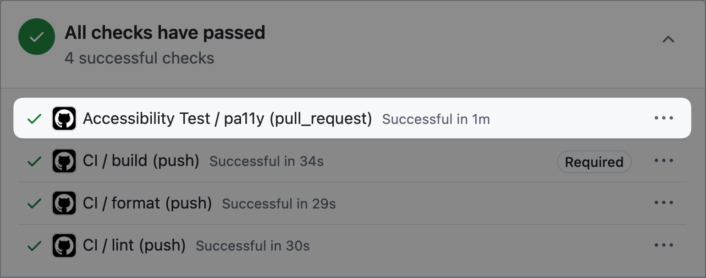
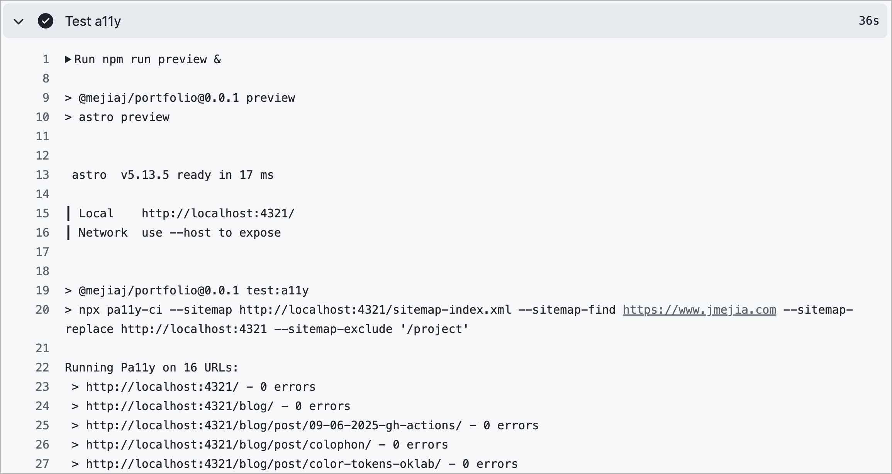

## Intro

So far, I've been relying on manual testing with axe devtools on this Astro site. It worked well when I updated this site a few times a year. After I started releasing small, frequent updates, a few accessibility regressions slipped by. I needed a way to catch any errors without worrying about manual checks.

## Prerequisites

You'll need the following npm packages:

- `pa11y-ci`
- `@astrojs/sitemap`, you can follow the setup instructions [here](https://docs.astro.build/en/guides/integrations-guide/sitemap/).

Once you have both dependencies installed and a sitemap setup, create a preview script so you can run a preview build of the site you'll eventually launch. Then setup a script to run pa11y against your sitemap.

**Note:** I'm using JSONC in code examples to add comments for clarity. You should use JSON though.

```jsonc
// package.json
"scripts": {
  "preview": "astro preview",
  "test:a11y": "npx pa11y-ci --sitemap http://localhost:4321/sitemap-index.xml --sitemap-find https://www.jmejia.com --sitemap-replace http://localhost:4321"
}
```

The `test:a11y` script is running pa11y-ci against the sitemap and replacing the production url with the local one.
Now you'll be able to run `npm run preview` and in another terminal tab run `npm run test:a11y` to scan for issues.

That's it for local testing. Now to automate with GitHub Actions.

## Automating

Create a pa11y config file:

```jsonc
// .pa11yci
{
  "defaults": {
    "chromeLaunchConfig": {
      "args": ["--no-sandbox"],
    },
  },
}
```

This will avoid issues of missing browser in GitHub Actions. Create a new workflow for the action:

```yml
# .github/workflows/a11y.yml

name: Accessibility Test
on: pull_request

# Explicitly set permissions for security.
permissions:
  contents: read

jobs:
  pa11y:
    runs-on: ubuntu-latest
    steps:
      - uses: actions/checkout@v5
      - uses: ./.github/actions/setup # This was done in `/blog/post/09-06-2025-gh-actions`
      - name: Run build
        run: npm run build
      # Runs the preview in the background.
      - name: Test a11y
        run: |
          npm run preview &
          PREVIEW_PID=$!              # Save the PID of the preview script.
          sleep 8                     # Wait in case the server is slow.
          npm run test:a11y
          kill "$PREVIEW_PID" || true # Stop the server with PID or exit in general.
```

Now, on every PR you see this check appear at the bottom:


If you click on the three dots on the right and view details you'll see the results of the scan:



## Conclusion

Now, every pull request in the future will test the accessibility and I can release updates much faster! You should still test manually for things like keyboard interactions, but this will catch common errors.

You can see the full pull request, [here](https://github.com/mejiaj/mejiaj/pull/133).
