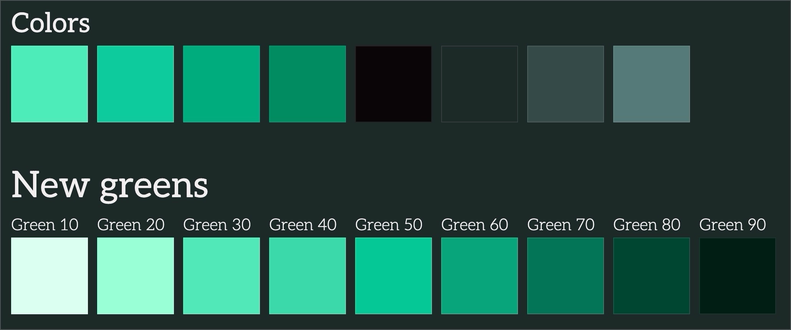
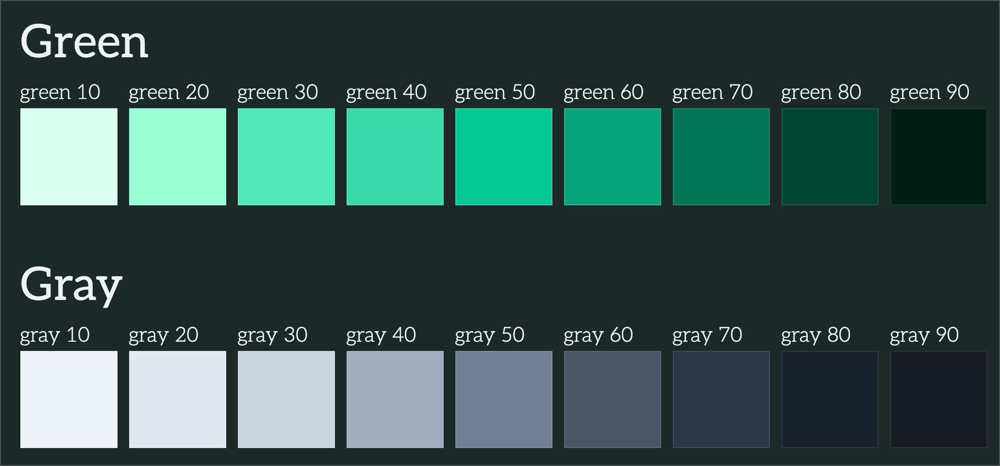

Over time, this site's color tokens have become a mix of my favorite colors from past themes. Some colors look similar to others and others are barnacles that have stuck around from years ago. I've wanted to improve this, but hesitated because the old styles relied heavily on SASS, a dependency I've been working to reduce. It hasn't been possible, until now!

The OKLab color space is relatively new and the `oklch()` CSS function became baseline in May 2023[^1]. Its supposed to allow more accurate, consistent, and accessible colors for the web.

## The problem with colors

Before, SASS has been a popular method to manipulate colors. For example, let's say a designer gave you the hex for a green, `#12d178`, and you had to come up with the light/dark variants of it.

An example of how shades and tints used to be created:

```scss
// _variables.scss
$color-green: #12d178;

// Add the color variants
// There's lots of ways to do this, but this used to be common:
$color-green-light: lighten($color-green, 10%);
$color-green-lighter: lighten($color-green, 20%);
$color-green-dark: darken($color-green, 10%);
$color-green-darker: darken($color-green, 20%);
```

The problem with this is that SASS only adds black and white to the color. Meaning, you won't get much of a cohesive color scheme. You'll just get dirtier or washed out colors. That's not SASS' fault, but a limitation at the time with colors on the web.

These days, there's HSLA and RGBA, but it's essentially the same problem.

That's just the general problem with manipulating colors in the old color spaces. When you have complex themes, like in a design system, and you **need** to make sure that color combinations are accessible. It turns into a bigger problem.

Things get complex pretty quick, but it _is_ possible with SASS and **a lot** of custom code.

_I know Safari introduced `color-contrast()` to help with accessible color combinations, but it's still experimental._

## Discovering OKLab

For the website, I just need a cohesive color palette, for now. Below is a screenshot of what I had before (the first row) and what I came up with using `oklch()` (the second row):



In the first row shows a diverse range of colors. Some are from the latest redesign, some are unused, and others are from old themes. This assortment is made up of hex colors and sass color functions to light and darken. A bit of a mess, I know.

**Before**

```scss
// _variables.scss

:root {
  // System colors defined.
  --color-green-1: #12d178;
  --color-green-2: #00c997;
  --color-green-3: #00ebbb;

  // Theme tokens reusing system to theme the site.
  --theme-primary-lightest: var(--color-green-3);
  --theme-primary-lighter: var(--color-green-3);
  --theme-primary-light: var(--color-green-3);
  --theme-primary: var(--color-green-1);
  --theme-primary-dark: var(--color-green-2);
}
```

Now the second row, with only green, I've made from the previous primary green and made it the medium, `50` value. Then, I used `oklch()` to create visually consistent shades and tints.

This had a few problems because:

1. The colors are limited, only three greens
1. The greens are using hex and pretty similar to each other
1. There's no consistency in how they're named or applied

### Implementing OKLab

The `oklch()` function allows you to set colors in a way that's similar to HSLA or RGBA, but more intuitive. The setup is:

1. **Lightness**: number or percentage.
1. **Chroma**: number or percentage, the amount of color.
1. **Hue**: number or angle.
1. _Alpha_: percentage, optional if you want to make it semi-transparent.

Converting the primary green, `#00c997`, to `green-50` I got the following palette:

```scss
// _variables.scss
:root {
  --color-green-10: oklch(97.03% 0.042 168);
  --color-green-20: oklch(92.59% 0.112 167);
  --color-green-30: oklch(83.83% 0.146 168);
  --color-green-40: oklch(79.33% 0.146 168);
  --color-green-50: oklch(74.18% 0.152 167);
  --color-green-60: oklch(64.11% 0.13 167);
  --color-green-70: oklch(49.64% 0.101 167);
  --color-green-80: oklch(34.35% 0.069 168);
  --color-green-90: oklch(20.87% 0.042 167);
}
```

You can see the numbers are very similar and I can easily create variations with a few changes. For example, creating lighter shades that look good is mostly a change to the first value, lightness.

You can also come up with accent colors or even add alpha to existing colors with the same function.

The example below uses an existing green and modifies the alpha value.

```scss
:root {
  --color-green-alpha-20: oklch(from var(--color-green-50) l c h / 0.2);
}
```

So you can see this is a pretty powerful native feature. No more SASS hacks required!

## Conclusion

Oklab can seem intimidating at first, but once you learn what each value does it's fun to create new colors. Even cooler that you're able to pass in a color variable and create a whole new color from it!

It was so easy, I was able to use a color palette tool to generate grays that fit with my primary color.

The new harmonious and more flexible color palette:



I highly recommend you use `oklch()` in your next project! You can see the colors and more live in the [styleguide page](/styleguide).

### Resources

- https://developer.mozilla.org/en-US/docs/Web/CSS/color_value/oklch
- https://evilmartians.com/chronicles/oklch-in-css-why-quit-rgb-hsl
- https://oklch.com - Convert hex to oklab
- https://huetone.ardov.me - Color palette tool

[^1]: https://developer.mozilla.org/en-US/docs/Web/CSS/color_value/oklch

---

## Bonus

The images shown above are using WebP image extension, which allows significant savings! Checkout the table below for specifics.

| Image                  | Before (`JPG`) | After (`WEBP`) |
| :--------------------- | :------------- | :------------- |
| Green comparison       | 128KB          | 57KB           |
| Styleguide new palette | 151KB          | 75KB           |
