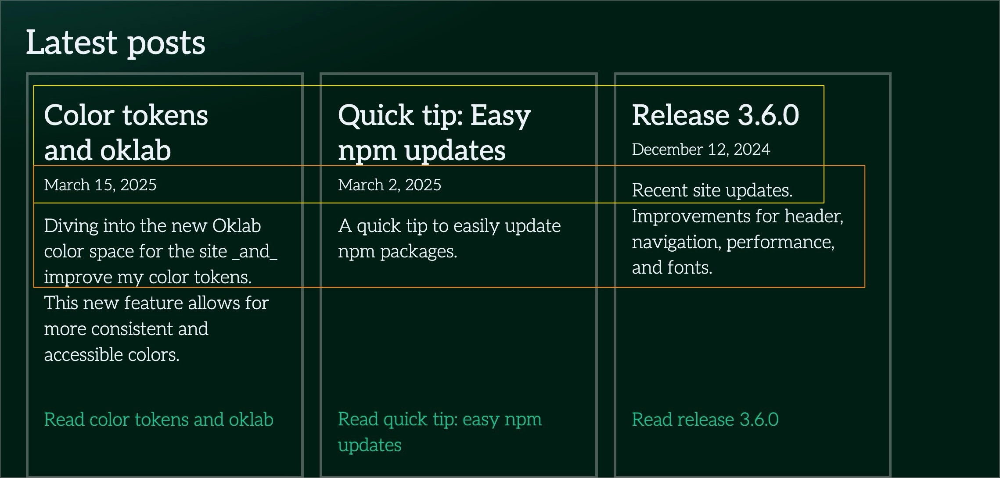
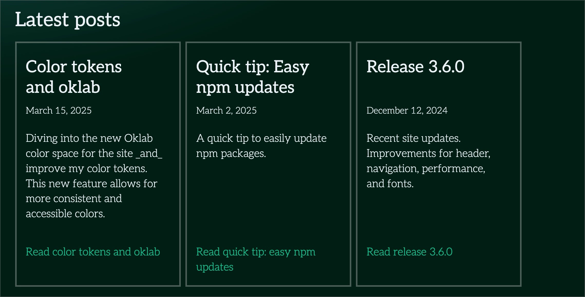

## The problem with cards

Card content naturally gets misaligned when you have long titles or copy. Before, you'd align inner card elements by setting a minimum height on each element.

Below, you can see a screenshot of the title, date, and body mismatching (_outlined in yellow and orange_).



### The fix

Now, you can take advantage of the new CSS subgrid feature so that the items inside, like the title, date, and body can align across the row.

You can see a full live demo on the homepage or in this codepen prototype:

<p class="codepen" data-height="300" data-theme-id="dark" data-slug-hash="emYPzxb" data-pen-title="Cards with CSS Subgrid" data-user="mejiaj" style="height: 300px; box-sizing: border-box; display: flex; align-items: center; justify-content: center; border: 2px solid; margin: 1em 0; padding: 1em;">
  <span>See the Pen <a href="https://codepen.io/mejiaj/pen/emYPzxb">
  Cards with CSS Subgrid</a> by James Mejia (<a href="https://codepen.io/mejiaj">@mejiaj</a>)
  on <a href="https://codepen.io">CodePen</a>.</span>
</p>
<script async src="https://public.codepenassets.com/embed/index.js"></script>

Once you create your grid columns for individual cards; each card will have subgrid so that inner elements are aligned correctly.

Here's a snippet of the styles that make this work:

```css
/* index.css */

/* Parent must have grid. */
.card-group {
  display: grid;
  grid-template-columns: repeat(3, 1fr);
}

/*
 * 1. Once we define subgrid, we define the number of rows
 *    that we want, e.g., we want four to align inner elements.
 */
.card {
  display: grid;
  grid-template-rows: subgrid;
  grid-row: auto / span 4; /* 1 */
}
```

Here's an after screenshot of the cards on the homepage.



## Conclusion

Subgrid can seem confusing at first, but I hope you can take the demo's code to improve your components too. I'm excited to see what else this feature can do and share that too.
